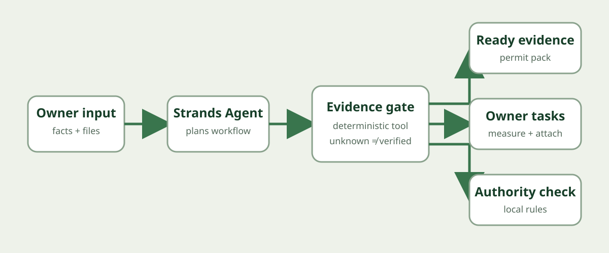

# Byggeklar Agent

Byggeklar Agent turns the repetitive preparation of a small Danish building case into a transparent evidence pack. It structures measurements, checks what is missing, prepares the document checklist and escalates only the decisions that require the owner, a professional, or the relevant municipality.

This is a **new Strands Agents SDK project built during the Agents for Humans submission period**. It draws on domain insight and a pre-existing Lovable concept named Byggetilladelse-Klar; the agent workflow, deterministic evidence engine, API, tests and demo in this repository are new hackathon work.

## Why it matters

Homeowners, tradespeople and small advisers repeatedly collect the same measurements, drawings and local-plan references before a building case is ready for review. Missing one item creates delays. A chat answer is not enough: the useful outcome is a structured pack with a visible audit trail and a short list of genuine human decisions.

Byggeklar Agent never presents itself as a permitting authority. Unknown facts stay unknown, and local rules are escalated to the municipality.

## End-to-end workflow

1. Capture the project type, municipality and measurements.
2. Classify the case using the supported small-project catalogue.
3. Run deterministic completeness checks.
4. Assemble ready and missing evidence.
5. Escalate address-specific rules to the municipality.
6. Produce a review-ready permit pack without inventing approval.

## Run locally

    python -m venv .venv
    source .venv/bin/activate
    pip install -r requirements.txt
    uvicorn app.api:app --reload

Open http://127.0.0.1:8000 and run the sample case.

## Tests

    python -m unittest discover -s tests -v

## Strands Agents SDK

app/strands_agent.py defines the Strands agent and exposes the deterministic permit-pack engine as a tool. The deterministic tool remains authoritative: the model may explain or sequence actions but cannot convert missing evidence into a verified fact.

## Architecture

Owner input → Strands Agent → deterministic evidence gate → ready evidence, owner tasks and municipality questions → review-ready permit pack.

## Integrity and safety

- No legal approval, customer traction, time saving, or accuracy rate is claimed.
- The demo uses a user-entered or sample case; it does not query private data.
- Address-specific rules must be verified with the relevant municipality.
- Secrets and AWS credentials belong outside the repository.
